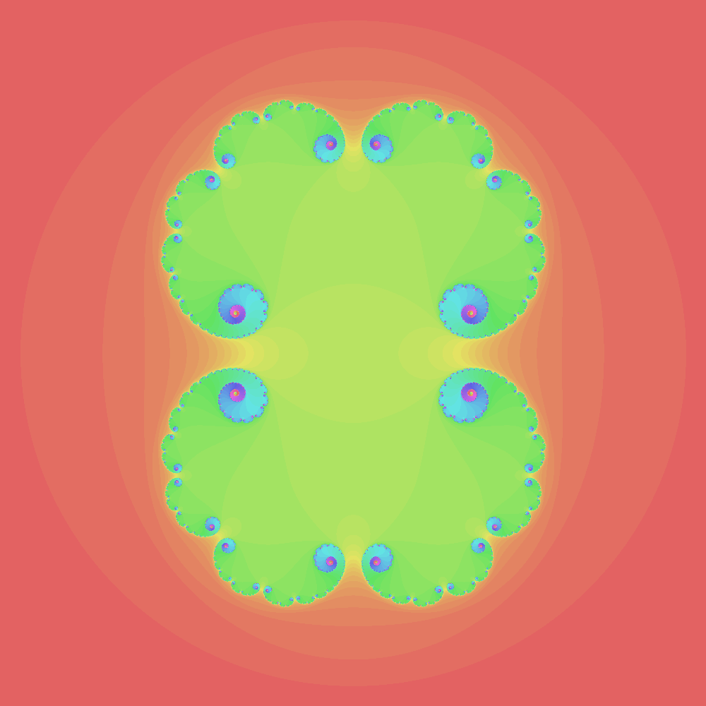

# Julia Sets (Rust)

Rust experiment to render Julia Sets images and gifs


### Examples

```sh
fractal --Cx="-0.4" --Cy 0.6 test1.png
```

## TODO

- Add tests
- Add loops to gifs
- Improve the code to generate gifs and images





